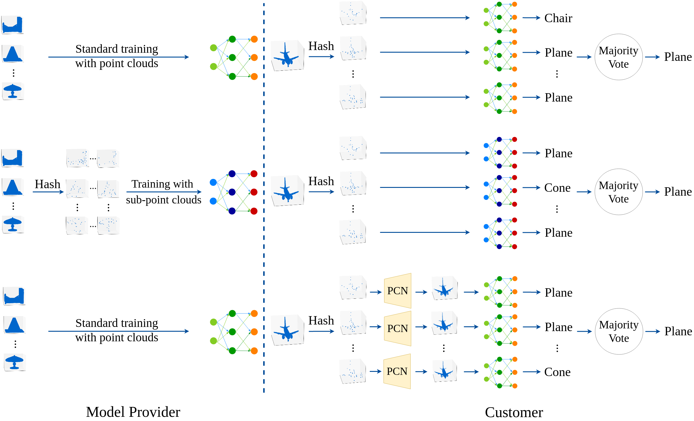

# Official Implementation of PointCert

## Introduction

This repo is the official implementation of PointCert in pytorch. 

For any other implementation details, please refer to our paper **PointCert: Point Cloud Classification with Deterministic Certified Robustness Guarantees**. (CVPR 2023) [[Paper](https://arxiv.org/pdf/2303.01959v1.pdf)] 





## Setup your virtual environment

- Initialize virtual environment:

      conda create -n PointCert python=3.7

- Install the [pytorch](https://pytorch.org/). The latest codes are tested on Ubuntu 16.04, PyTorch 1.8.1 and Python 3.7:

      pip install torch==1.8.1
      pip install torchvision==0.9.1


## Preparation

### Download the code and ModelNet40

1. Clone this repo from the GitHub.

        git clone https://github.com/jzhang538/CVPR23-PointCert.git

2. Download ModelNet40 dataset [[here](https://modelnet.cs.princeton.edu/)] and save it to `./data/modelnet40_normal_resampled`.

3. Finally, your directory structure should look something like this:

        CVPR23-PointCert
        └── data
            └── modelnet40_normal_resampled
            	└── modelnet40_shape_names.txt
            	└── modelnet40_provider.txt
            	└── ...
            	└── class1 (e.g., xbox)
            	└── class2 (e.g., wardrobe)
            	└── ...

### Preprocess ModelNet40

Use the following command to preprocess ModelNet40 dataset. Specifically, we divide each point cloud into sub-point clouds based on the MD5 hash values. By default, the number of sub-point clouds for each point cloud is 400. (The argument **num-group** indicates **m** in our paper)

    python3 preprocess.py --num_group 400

### Compile distance libraries for PCN:

    cd distance
    python3 setup.py install


## Run the PointCert (Scenario II)

1. Train a base point cloud classifier provided by a model provider using **sub-point clouds**:

        python3 scenarioII/train_provider_scenarioII.py --num_group 400

2. Certify the base point cloud classifier in Scenario II:

        python3 scenarioII/test_scenarioII.py --num_group 400 --use_ensemble \
            --classifier_path ./scenarioII/provider/best_model_m_400.pth


## Run the PointCert (Scenario III)

1. Train a base point cloud classifier provided by a model provider in a standard manner (using **point cloud or subsampled point cloud**, e.g., 1024 points):

        python3 scenarioIII/train_provider_scenarioIII.py --num_point 1024

2. Train a PCN using unlabeled (or partially labeled) customer point clouds (e.g. PCN takes sub-point clouds with 32 points as input to output a reconstructed point cloud with 1024 points):

        python3 scenarioIII/train_customer_scenarioIII.py --num_group 400 \
            --num_input 32 --num_recon 1024 --ratio 0.25 --l 0.0005 \
            --classifier_path ./scenarioIII/provider/best_model_standard_1024.pth

3. Certify the base point cloud classifier in Scenario III:
        
        python3 scenarioIII/test_scenarioIII.py --num_group 400 --use_ensemble \
            --classifier_path ./scenarioIII/provider/best_model_standard_1024.pth \
            --pcn_path ./scenarioIII/customer/best_model_m_400_input_32_recon_1024.pth


## Draw certified accuracy curves

Use the following command and the results are saved at './curves' folder.

	python3 draw_certified_accuracy_curve.py --scenario II
	python3 draw_certified_accuracy_curve.py --scenario III


## Pretrained Models

Download pre-trained models [[here](https://drive.google.com/file/d/1V6dfGPg3-DBugfKgtXeVQGJtXwEtpiv5/view?usp=sharing)] and put them to corresponding folders.


## Note:

- Please skip sub-point clouds with extremely small number of points (e.g., <4) during training when num-group in scenarioII is large!!!

## Contact us
If you have any issues with the code, please contact to this email: <jinghuai.zhang@duke.edu>

## Citation
If you find our work useful for your research, please consider citing the paper
```
@article{zhang2023pointcert,
  title={PointCert: Point Cloud Classification with Deterministic Certified Robustness Guarantees},
  author={Zhang, Jinghuai and Jia, Jinyuan and Liu, Hongbin and Gong, Neil Zhenqiang},
  journal={arXiv preprint arXiv:2303.01959},
  year={2023}
}
```
